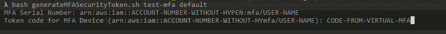
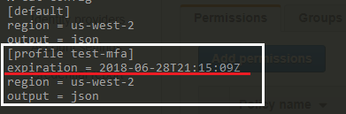
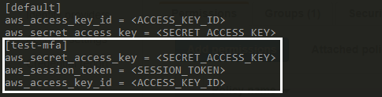

# Require MFA on all AWS API call
## Requirement
 - AWS CLI
 - IAM Policy requiring MFA 

## IAM Policy Condition

  ```
  ...

  "Condition": {
      "NumericLessThan": {
          "aws:MultiFactorAuthAge": "14400"
      }
  }

  ...
  ```
  14400 seconds = 4 hours 

## Generating Token
 - execute the script with the MFA Profile Name and Base Profile name as arguments

  ```
  ./generateMFASecurityToken.sh test-mfa default

  ```

  $1 = name of the mfa profile to be created  
  $2 = the name of the base profile whose keys will be used to generate the sts token  

  The script will ask for the MFA ARN and the code from your virtual MFA device

  

  - The updated AWS config and credentials will look like this

  

  

## Running the aws command

   ```
   aws stop-instances --instance-ids i-1234567 --profile test-mfa
   ```


## Reference
 * [Configure Multi-Factor Authentication (MFA) with AWS CLI](http://prasaddomala.com/configure-multi-factor-authentication-mfa-with-aws-cli/)
   Code from this blog, just tweaked the part to set the MFA Serial Number
